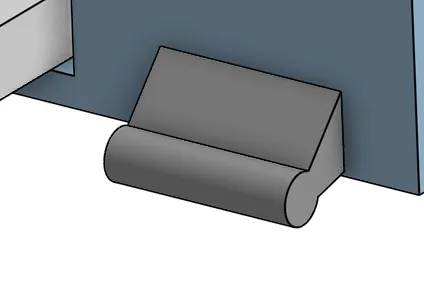
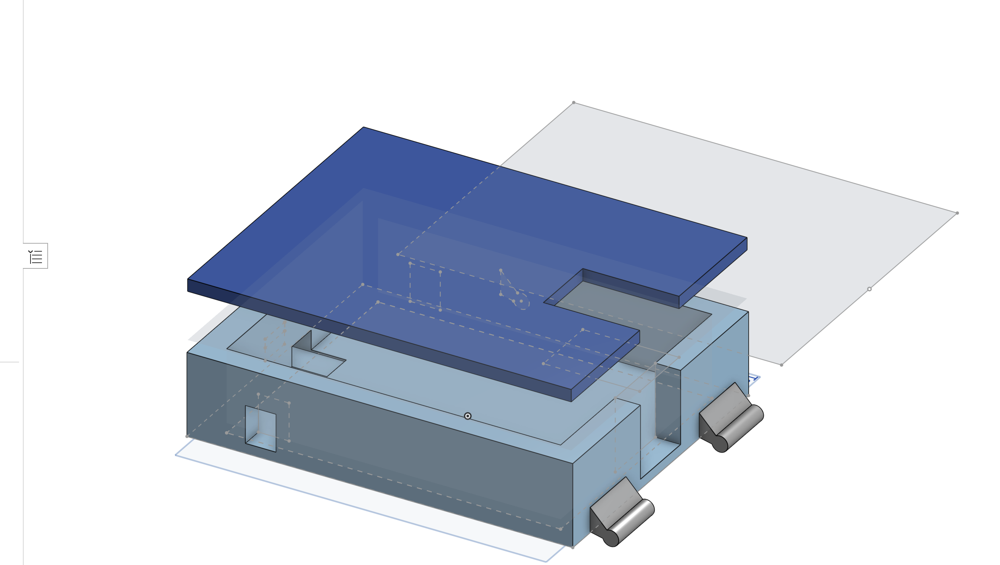
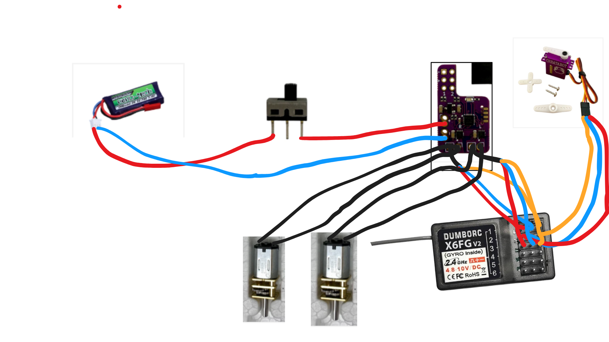
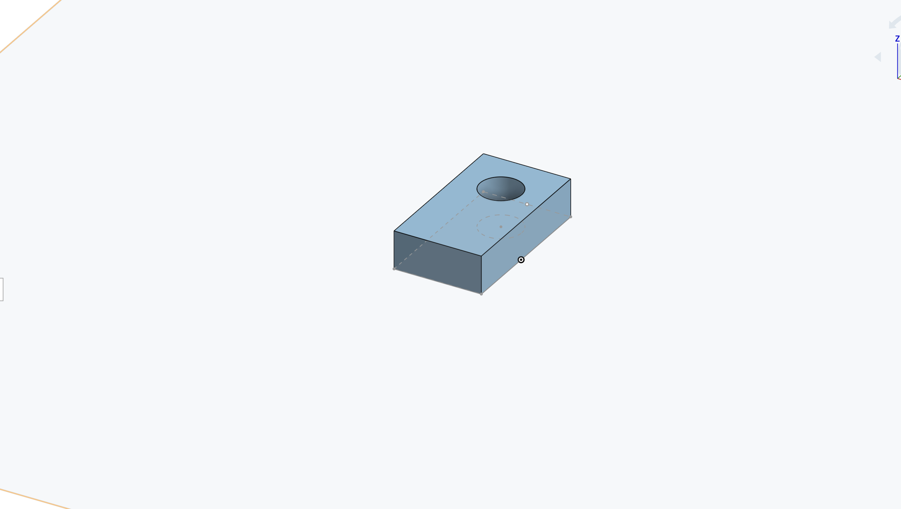
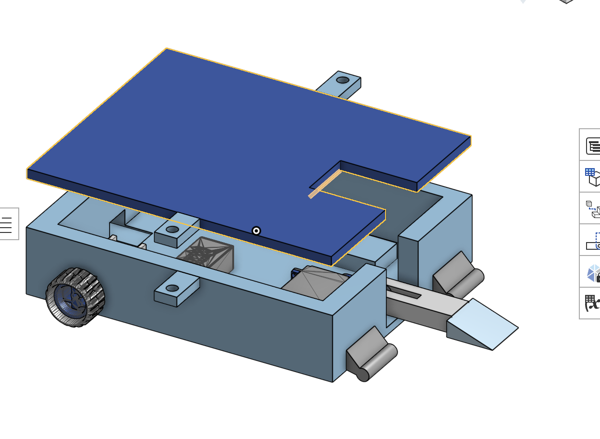
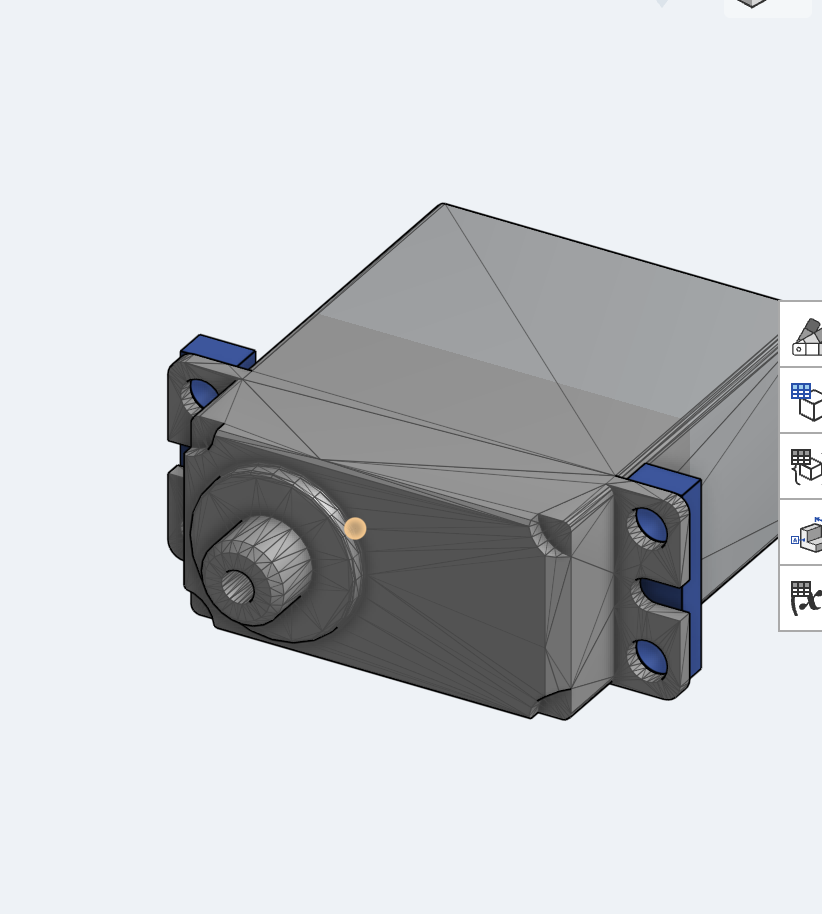
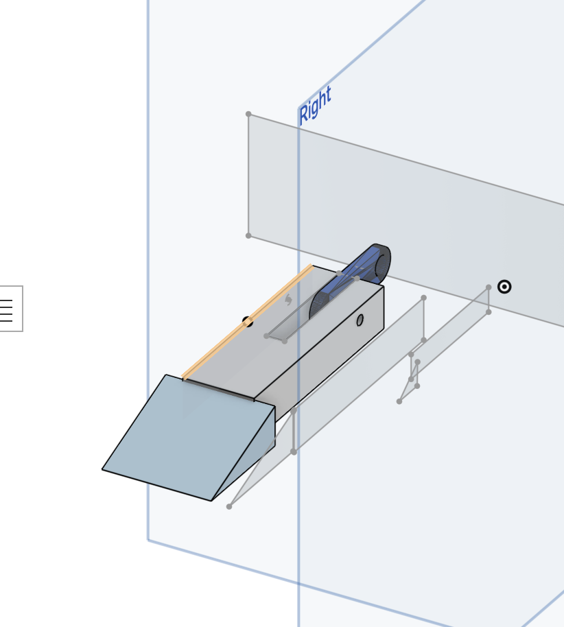

# plastic-ant-flippy

## Onshape Link

In case you need/want the Onshape link, it can be found here: https://cad.onshape.com/documents/fc911dea527d6414b0abc718/w/4e3ed9dadcd457da9ff39912/e/f9b23762fbe1540fc806aae5?renderMode=0&uiState=69b76606d3525f96e712c90c

## Idea

This is a simple Plant class flipper bot. The main big design choice here is the type of wedges. I decided that, for simplicity, I'd use a circular/oval type  wedge which should just slip across both wood and metal flooring without the risk of getting stuck. 

## Printing

The plant will most likely be printed out of PLA+, then I may remake it with TPU and some extra armor as a normal antweight robot.

## Chassis 

Here's a photo of the Chassis! On the full assembly, it's put together with two little extension things with holes to put screws and nuts through.

## Electronics

For the actual important parts of the robot, I'm using 2 N20 1400 RPM motors, the Startabot DESC, the Createabot Servo, and a 2S battery. Here's a schematic!

The channels are as follows:
CH1 - Left Motor
CH2 - Right Motor
CH3 - Servo

## Misc Photos/Screenshots

